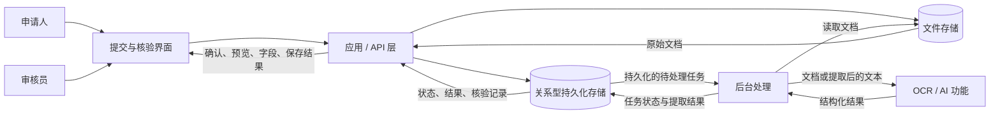
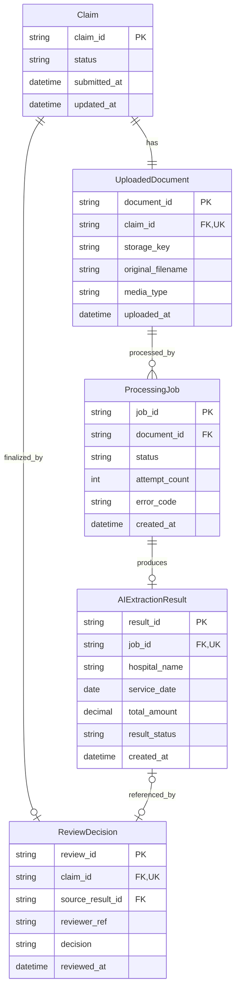

# MedClaim Review — 架构提案

## 1. 文档目的与设计状态

本文描述 MedClaim Review 的拟议架构：通过 AI 辅助提取医疗票据信息，再由人工核验。本文应结合项目 [README](README.zh-CN.md) 阅读。

项目当前处于提案与规划阶段。本文说明计划中的行为，不代表功能已经实现或验证。

主要流程、提取字段、人工核验要求和范围排除项遵循 README。下文的 schema、状态、API 草案和可靠性规则均为拟议设计。框架、数据库产品、文件存储产品、任务分发机制、OCR/AI 工具和部署结构仍待选择。

## 2. 问题、用户与范围

医疗理赔审核员需要反复读取票据并录入医院名称、服务日期和总金额。MedClaim Review 希望减少这些工作，同时由审核员对最终字段值负责。

| 角色 | 职责 |
| --- | --- |
| 申请人 | 提交理赔申请及票据，获得提交确认和 Claim ID。 |
| 医疗理赔审核员——主要用户 | 查看处理状态和原始文件，确认或纠正提取字段，手工填写缺失值，保存最终核验信息。 |

这些是业务角色。身份认证、审核员身份标识和访问控制的实现另行设计；不能仅凭 Claim ID 就认定用户有权访问申请。

建议初期每份申请接受一个票据文件，可为 PDF 或图片。支持的语言、版式、图片格式、页数上限、文件大小上限和币种约定，必须在公布支持范围前选定并验证。“单文件”是范围建议，不是现有实现限制。

范围内包括提交、文件和元数据持久化、异步提取、可见状态、提取结果存储、文档预览、人工纠正，以及处理失败后的人工处理或重试。手写识别、欺诈检测、医疗诊断、最终理赔批准及其他无关理赔流程不在范围内。核验完成仅表示信息已检查，不授权保险赔付。

## 3. 主要工作流程

1. 申请人提交理赔申请并附上 PDF 或图片。
2. 应用校验请求及所支持的文件属性，保存文件，记录申请与文档元数据。
3. 创建持久化的 `PENDING` 处理任务，返回 Claim ID 和确认信息，不等待提取完成。
4. 后台 worker 取得任务执行权，记录开始处理，读取已保存的文档。
5. OCR/AI 功能提取 `hospital_name`、`service_date`、`total_amount`，并在适用时提供置信度或结果状态。
6. worker 校验并保存结果，完成任务，使申请可供人工核验。
7. 审核员对照原始文档检查字段，确认、纠正或手工补全。
8. 应用校验并保存最终值和核验记录，与 AI 原始输出分开保存，然后将申请标记为 `reviewed`。

### 异常路径

- **提交被拒绝：**在接受申请前报告不支持或无效的输入。未被接受的提交不应留下可执行的提取任务。
- **低置信度、部分结果或无效字段：**明显标记需要处理的问题。缺失值保持为空，不能编造替代值。审核员可以手动补全。
- **处理失败：**任务变为 `FAILED`，保存适合展示的错误说明，申请进入可人工核验状态。审核员也可选择发起符合条件的重试。
- **核验保存失败：**界面提示保存失败，并保留已输入内容以便重新提交；保存成功前不能显示为已核验。

提取成功也必须经过人工核验。只要原始文件仍可访问，提取失败就不应阻止审核员完成工作流程。

## 4. 逻辑架构

这些方框表达逻辑职责，不意味着必须独立部署。

| 组件 | 职责与数据 | 触发方式 | 失败行为与边界 |
| --- | --- | --- | --- |
| 提交与核验界面 | 收集提交；展示状态、原件、AI 字段和可编辑的最终值。 | 申请人或审核员操作；状态刷新。 | 显示可处理的错误及未保存状态；不决定理赔是否批准。 |
| 应用/API 层 | 校验请求；协调文件存储、申请/文档/任务创建、查询和核验写入。 | 客户端请求。 | 返回明确错误，保持记录一致；提交时不等待 OCR。 |
| 持久化层 | 保存关系型业务记录和持久化文件。 | 应用和 worker 的读写。 | 拒绝无效关联，支持事务更新；文件与关系型元数据分开存储。 |
| 后台处理 | 取得任务执行权、读取文件、调用提取、保存结果或失败信息。 | 待处理任务或已接受的重试。 | 使用有限超时与恢复机制，公开失败状态；不写入人工最终字段。 |
| OCR/AI 功能 | 将文档或 OCR 文本转换为限定的结构化输出。 | worker 调用。 | 返回结果或明确错误；不修改申请状态，不批准理赔。 |

应用和 worker 负责业务流程持久化。OCR/AI 是库、本地服务还是外部集成，需要通过可行性检查再决定。基础方案必须有不依赖不可获得数据或付费服务的可行路径。

## 5. 数据模型与持久化

### 5.1 拟议实体与关系

建议采用关系型模型，因为申请、文件、任务、提取结果和核验记录之间具有明确关联和一致性要求。数据库产品尚未选择。

图中描述的是已接受的申请，按拟议的单文件范围设计。每份申请有一个文档、至多一条最终核验记录。文档在生命周期中可关联处理任务，但同一时刻至多一个任务处于活动状态。每个任务至多产生一份提取结果。核验记录可引用提取结果；处理失败时也允许没有来源结果。重新打开已完成核验及一份申请包含多个文档，不属于初期范围。

| 实体 | 图外的重要字段与规则 |
| --- | --- |
| `Claim` | 稳定标识；必填状态、提交时间和更新时间。最终字段值属于核验记录，不重复复制到此表。 |
| `UploadedDocument` | 必填申请引用、唯一存储标识、原文件名、媒体类型、字节大小和上传时间；可选内容指纹用于追溯。存储标识由系统生成，不直接取用户文件名。 |
| `ProcessingJob` | 必填文档引用、状态、非负尝试次数和创建时间；可空的开始/结束时间、安全错误码及说明。使用执行令牌或等效机制区分当前执行与过期执行。 |
| `AIExtractionResult` | 必填且唯一的任务引用；缺失或无效的提取字段允许为空。保存 `result_status`、字段校验问题、可选置信度、提取/模型/规则版本、适用时的提示词版本，以及创建时间。没有有意义的分数时置信度为空。 |
| `ReviewDecision` | 必填申请引用、审核员标识、核验结果、最终医院名称/服务日期/总金额、核验时间；来源结果和备注可选。拟议结果为 `confirmed`（确认）、`corrected`（纠正）或 `manually_entered`（人工录入）。纠正和人工录入需填写简短原因。 |

日期使用日期类型，时间戳统一采用 UTC 约定。金额使用精确十进制数，而非浮点数。精度、币种约定和业务校验规则须在实现前确定。如使用置信度，应说明量表和来源，不假定其是经过校准的正确概率。

外键约束实体关系；应用还必须检查所引用的提取结果确实属于正在核验的申请。最终必填字段校验通过后才能完成核验。通过唯一约束和带条件的更新防止多条最终核验、重复结果和同一文档的并发活动任务。索引应支持按申请状态/提交时间查询，以及按待处理任务/状态查询；具体索引定义在实现 schema 时确定。

### 5.2 哪些持久化、哪些记录日志、哪些计算获得

| 类别 | 数据 | 原因 |
| --- | --- | --- |
| 关系型持久化 | 申请、文档元数据、任务状态/尝试次数、提取输出及版本、最终核验值、审核人和原因。 | 作为持久的业务事实，并解释人工纠正。 |
| 文件持久化 | 原始 PDF 或图片。 | 用于预览、提取输入和后续核验。 |
| 日志 | 关联标识、操作名、耗时、安全错误码及去除敏感内容的诊断信息。 | 用于排查问题；日志不能是业务结果的唯一记录。 |
| 派生数据 | 待审核数量、失败率、处理耗时和纠正率。 | 可从已保存的记录和时间戳计算。 |

审核员纠正字段时保留 AI 原始结果。除非有明确评估或调试需要，默认不保存全文 OCR 文本或服务商原始响应。初期模型保存当前任务状态和尝试次数，不承诺保留每次执行的完整事件历史；只有恢复或评估确有需要时，再增加独立事件表或执行尝试表。

### 5.3 一致性与 schema 演进

文件存储和关系型事务可能无法共同原子提交。建议先校验并持久化文件，再在一个数据库事务内创建申请、文档元数据和初始任务。两部分均成功后才返回接受确认。数据库写入失败时清理文件；清理被中断时，应通过可恢复的孤立文件清理流程处理。worker 仅执行已经提交的任务。

保存提取结果及其成功的任务/申请状态转换，放在同一事务内；保存最终核验值与将申请改为 `reviewed` 也放在同一事务内。写入失败不能留下“状态成功但相关数据不存在”的情况。

数据库结构通过经审查、带版本的迁移演进，模型、迁移脚本和相关文档一起更新。验证空库创建及保留已有记录的升级流程。迁移工具尚未选择；仅修改应用模型不足以完成数据库变更。

## 6. 状态转换与修改责任

Claim 状态表达业务进度，Job 状态表达执行情况。拟议申请状态为 `queued`、`processing`、`needs_review` 和 `reviewed`。提交动作由 `submitted_at` 记录，初期不需要单独的瞬时 `submitted` 状态。所有提取完成的申请都需要人工核验，因此也不单设 `extracted` 状态。

| 记录 | 转换 | 执行者及条件 | 保存的证据 |
| --- | --- | --- | --- |
| 申请 + 任务 | 新建 → `queued` + `PENDING` | 应用接受有效且文件已持久化的提交。 | 申请、文档、任务和时间戳。 |
| 申请 + 任务 | `queued` → `processing`；`PENDING` → `PROCESSING` | worker 原子取得独占执行权。 | 开始时间、递增后的尝试次数、执行权标识。 |
| 申请 + 任务 | `processing` → `needs_review`；`PROCESSING` → `COMPLETED` | worker 保存结构化结果，包括需人工处理的部分结果。 | 提取结果、校验问题、完成时间。 |
| 申请 + 任务 | `processing` → `needs_review`；`PROCESSING` → `FAILED` | worker 或恢复流程记录执行失败。 | 安全错误信息及结束/失败时间。 |
| 申请 + 任务 | `needs_review` → `queued`；`FAILED` → `PENDING` | 应用接受审核员请求的重试，且未达尝试上限、没有最终核验或活动执行。 | 重试转换；保留累计尝试次数。 |
| 申请 + 核验 | `needs_review` → `reviewed`；新建核验记录 | 审核员提交有效最终值；应用确认没有并发启动重试。 | 最终字段、审核员、核验结果、可选来源结果、原因和核验时间。 |

`COMPLETED` 表示提取操作产生了已保存结果，不表示字段一定正确。无法安全解释的畸形响应属于处理失败；可以解释但有缺失或无效字段的结果，可保存为 `result_status = needs_attention`。

核验完成与重试会竞争同一个可操作申请状态，需要串行化或版本检查。申请进入 `reviewed` 后，初期不允许重试。过期 worker 的完成写入必须被执行权/状态检查拒绝，不能替换最终核验或重新打开申请。重试期间界面可显示旧结果，但应标明它是历史结果，并在处理仍活动时禁止最终核验提交。

## 7. API 与服务边界

以下是说明性的 HTTP 契约，不是已经实现的 API。具体请求 schema 和路由名称在 API 设计阶段确定。所有对外操作通过应用层进行；客户端不直接访问存储或调用提取功能。

| 拟议操作 | 输入 | 响应/效果 |
| --- | --- | --- |
| `POST /claims` | 申请及一个文件，采用 multipart 上传。 | 持久化接受后返回 `202 Accepted`，包括 `claim_id`、`job_id`、状态和状态查询地址；不等待提取。 |
| `GET /claims` | 可选状态过滤及分页参数。 | 审核工作列表，包含业务及处理状态。 |
| `GET /claims/{claim_id}` | Claim ID。 | 元数据、当前任务状态、可用的提取结果及问题、已有最终核验记录。 |
| `GET /claims/{claim_id}/document` | Claim ID 和访问身份上下文。 | 通过受控访问提供原件预览或下载。 |
| `PUT /claims/{claim_id}/review` | 最终字段、核验结果、可选来源结果、原因/备注及预期申请版本。 | 原子保存最终核验并返回已核验状态；相同请求重放不能新增另一条核验记录。 |
| `POST /claims/{claim_id}/retry` | Claim ID 及预期失败任务/版本。 | 成功重新排队时返回 `202 Accepted`；过期或不符合条件的请求被拒绝。 |

校验包括必填字段、文件属性、金额/日期格式、来源结果归属和合法状态转换。预期错误包括无效输入、不支持的类型、文件过大、记录不存在、权限不足、状态冲突，以及存储暂时不可用。最终契约将明确状态码和响应体。对已完成核验重复提交不同值属于冲突，不能静默替换原有最终记录。

状态刷新初期可以采用客户端简单轮询；初期范围不要求推送更新。若提交响应丢失后重试，可能产生重复申请；在自动执行这种重试之前，API 设计必须定义幂等键或等效的重复提交策略。

内部提取契约接收文档引用，或文档内容/派生文本，以及关联信息；返回限定字段、结果状态、可选置信度、版本及校验/错误信息。这是逻辑契约，不要求独立网络服务或公开提取接口。

## 8. 后台处理与 AI

### 8.1 执行与恢复

后台处理必须在提交请求结束后继续运行。无论最终采用什么分发机制，持久化任务记录都是执行状态的依据。

1. 发现待处理任务并原子领取，防止两个执行同时拥有同一次尝试。
2. 记录执行权、开始时间和尝试次数，读取原件。
3. 在有限超时下调用 OCR/提取，校验返回结构和各字段。
4. 在同一事务中提交结果和成功状态；或保存安全失败信息并开放人工核验。
5. 通过租约/心跳或等效的有界恢复规则，检测 worker 停止后残留的 `PROCESSING` 任务。撤销旧执行权并标记失败，使其可人工处理或重试。

初期建议由审核员发起有限次数的失败重试，不采用无限自动重试循环。重试上限、超时和恢复阈值根据样本处理测量确定。重试不清空尝试次数。详细诊断可保留在去除敏感内容的日志中；初期 schema 不承诺完整的逐次执行历史。

重复执行时结果写入必须安全：任务/结果唯一关系和当前执行权检查用于阻止重复结果与过期完成。如果选择消息中间件，须协调持久化任务创建与分发，防止通知失败导致已提交任务丢失。

### 8.2 有明确边界的提取功能

| 项目 | 拟议行为 |
| --- | --- |
| 输入 | 上传的医疗票据，或通过 OCR/文档文本提取获得的文本。 |
| 输出 | 医院名称、服务日期、总金额，以及有意义时的置信度或结果状态。 |
| 校验 | 检查类型、必需字段是否存在、日期含义、金额/币种约定；保留不确定性，不猜测缺失值。 |
| 核验支持 | 并列展示原件和提取字段，明显标记缺失、无效或不确定值。 |
| 回退 | 部分结果或失败后人工纠正/录入；处理失败可有限重试。 |
| 可追溯性 | 输出关联任务和文档；保存提取版本、适用时的提示词版本、时间戳，人工纠正单独保存。 |

文档内容是输入数据，不是可授权业务操作的指令。如果使用生成式模型，其输出作为不可信数据，在持久化或展示前校验。模型不能批准理赔或修改已核验值。

工具选择将通过小规模合成或匿名化、人工标注的样本集比较实际提取效果。团队在确定工具前确认格式/语言支持、运行资源、可复现性和成本。“本地 OCR 加结构化提取”是候选方案，不是已选技术栈。mock 可辅助集成开发，但不能作为真实票据提取能力的演示。

## 9. 可靠性、隐私与验证

原型使用合成或匿名化文档。避免在元数据或日志中保存不必要的患者标识、诊断、支付详情及其他敏感内容。原始文件仍需受控访问及明确的保留/删除策略。若考虑外部提取服务，须明确决定哪些数据会离开应用。本文不宣称达到生产安全或法规合规标准。

运行可见性应包括带申请/任务关联标识的结构化日志、适用的组件存活及依赖就绪检查，以及待处理任务、处理耗时、失败和停滞任务等基本指标。业务状态和核验结果保存在持久记录中，而不只记录在日志中。

| 验证场景 | 预期证据 |
| --- | --- |
| 有效提交 | 文件及关联申请/文档/任务在请求结束后仍存在；提取完成前已返回确认。 |
| 提取成功 | 已知样本字段被保存，并与原件一起展示。 |
| 部分/无效输出或提取服务不可用 | 问题可见；审核员能够手工录入并保存最终核验。 |
| 人工纠正 | AI 原始结果不变；可查询最终字段、操作者和原因。 |
| 重试或 worker 中断 | 尝试次数和状态一致；过期完成和重复执行不破坏结果。 |
| 并发核验/重试或重复保存 | 只有一个合法结果生效；不会产生重复最终核验或被 worker 覆盖。 |
| 文件存储/数据库失败 | 不会接受指向尚未完成上传的申请；清理/恢复流程处理孤立文件。 |
| schema/部署复现 | 新环境创建预期 schema；迁移保留已有业务记录；重启后文件仍可访问。 |

这些是计划中的检查，不是已完成的测试结果。产品评估应通过标注样本测量字段正确性和纠正工作量；运行评估应测量处理时间及失败/恢复行为。团队将在评估前商定数值目标、样本数量和测量规程。

## 10. 风险、范围控制与待定事项

### 10.1 主要风险与计划应对

| 风险 | 影响 | 应对计划/范围裁剪 |
| --- | --- | --- |
| 尚未选择版式、语言，或票据字段含义不明确 | 提取效果可能较差，或无法评价。 | 尽早验证小规模标注样本；仅承诺已展示的格式，明确服务日期和总金额含义。优先裁剪额外版式/语言。 |
| OCR/AI 资源或服务依赖 | 演示可能依赖不可获得的硬件、数据或付费访问。 | 集成前验证可行基础方案；降低模型复杂度，裁剪可选外部集成。 |
| 文件、任务和结果不一致 | 申请可能卡住或丢失输入/结果。 | 使用带条件检查的事务、孤立文件清理、执行权控制和失败恢复；验证失败路径。 |
| 人工核验与重试竞争 | 最终值被覆盖或保存冲突结果。 | 串行化符合条件的状态转换，分开保存 AI 与人工记录；暂不支持重新打开已完成核验。 |
| 产品范围过大 | 初期完整流程可能无法完成。 | 优先一个文件、一个提取任务和一次最终核验；裁剪高级仪表盘、批量上传、复杂账号管理、推送更新和云端集成。 |

### 10.2 交付边界

初期交付目标是一条真实、完整的提取和核验流程：上传受支持样本、持久化、异步处理、展示原件和字段、纠正并保存最终值，并演示提取失败后的人工完成。持久化、后台路径、人工核验和可见的失败处理是核心，不是优先裁剪项。

后续工作将加强可复现部署、恢复、可观测性和评估。详细进度安排、职责分配及产品/运行 KPI 将在项目规划中确定。

### 10.3 待解决的决定

| 待定事项 | 需要解决的时点与内容 |
| --- | --- |
| 支持的文档 | 提取实现前：选择样本来源、语言/版式覆盖、文件/页数限制、币种及字段含义。 |
| 框架与持久化产品 | 实现规划时：根据拟议流程选择应用、关系型存储、文件存储和迁移工具。 |
| 任务分发与恢复 | worker 实现前：选择任务发现/分发、执行权机制、超时、重试上限和崩溃恢复方式。 |
| OCR/AI 方法与结果质量信号 | 确定提取集成前：验证真实样本、资源、版本记录及置信度/状态含义。 |
| 身份与文件访问 | 共享演示前：定义审核员标识、申请人/审核员权限及受控文件访问。 |
| API 重放与核验并发 | API 定稿前：定义提交幂等性、版本检查和重复保存行为。 |
| 数据生命周期与评估 | 收集样本或开展评估前：约定保留/删除规则、标准答案、指标和测试条件。 |

团队应通过小规模可行性检查解决这些问题，并在设计演进时记录理由。
