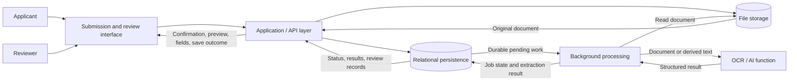
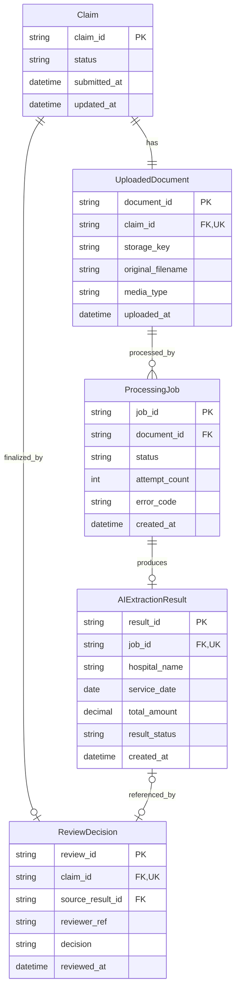

# 第 4 周提交 — 团队架构提案与项目计划

> 本文件是英文提交文档的中文翻译，供内容审阅使用。英文提交入口为 `MAIE6000C-Group-18/submissions/week04/README.md`。图中的实体和字段标识保留英文，以便与架构设计对应。

## 团队信息

- **团队名称：** Group 18
- **团队成员：** Luo Xiaoyu、Gao ge、Shi Jingyi
- **代码仓库：** [MAIE6000C-Group-18](https://github.com/TBgit137/MAIE6000C-Group-18)
- **要求的检查点标签：** `w04-proposal`
- **项目名称：** MedClaim Review
- **所选项目标题：** Medical Claim & Invoice Review Pipeline（医疗理赔与票据审核流水线）
- **主要提交文件：** `submissions/week04/README.md`

本文件描述计划中的工作，不是已实现或已验证能力的报告。内容与[项目概述](<D:/work/MAIE6000C-Group-18/README.md>)和[架构提案](<D:/work/MAIE6000C-Group-18/docs/architecture.md>)保持一致。技术选型尚未确定。检查点标签将在最终审阅后创建并推送。

## 1. 问题背景

医疗理赔审核员需要反复阅读提交的票据，并手工录入医院名称、服务日期和总金额。这些工作耗时，也容易产生抄录错误。MedClaim Review 计划自动提取这些字段并交由人工核验，从而减少手工录入。

**医疗理赔审核员是主要用户。** 申请人提交理赔材料；审核员检查原始文件，纠正或补全字段，并保存最终信息。这些是业务角色，身份识别和访问控制的实现细节将在实施规划中确定。

初期范围为每份申请上传一个 PDF 或图片形式的票据文件，随后进行异步提取和一次最终人工核验。核验完成表示信息已检查，不表示理赔或保险付款已获批准。手写识别、欺诈检测、医疗诊断、自动最终审批及无关理赔流程不在范围内。

## 2. 用户流程

1. 申请人提交医疗理赔申请，并附上一个 PDF 或图片文件。
2. 应用校验提交内容，持久化保存文件，并记录申请和文档元数据。
3. 应用创建 `PENDING` 处理任务，无需等待提取完成即可返回确认信息和 Claim ID。
4. 后台 worker 取得任务执行权，读取文件并调用 OCR/AI 提取。
5. worker 校验并保存提取字段及其置信度或结果状态，随后更新处理状态。
6. 审核员对照原始文件查看提取结果和相关问题。
7. 审核员确认、纠正或手动填写必需字段。
8. 应用将最终值和核验记录与原始 AI 输出分别保存，并将申请标为 `reviewed`。

成功提取仍需人工核验。不完整、无效或低置信度字段会被标记为需要关注。处理失败时，任务变为 `FAILED`，申请仍可人工核验或按规则重试。只要原始文件可用，即使没有 AI 结果，审核员也能完成字段填写。核验保存失败不能显示为核验完成。

## 3. 成功标准

Week 7 的最低验收条件是一个可运行的纵向切片：受支持的样本经过提交、持久化存储、真实的异步提取、原件与结果展示、人工纠正和最终保存。另一个受控提取失败场景必须能够显示错误并支持人工完成。保存后，两种场景的结果都必须能够重新查询；有原始 AI 输出时应保留该输出。

以下 KPI 是评估计划，不是已测结果，也不代表已经证实的性能。

| 类型 | KPI | 测量计划 |
| --- | --- | --- |
| 产品 | 字段提取正确率 | 按约定的标准化规则，将三个提取字段分别与人工标注答案比较。分别报告医院名称、服务日期和总金额的正确率；存在参考值时，缺失或无效输出计为错误。 |
| 产品 | 审核员纠正或补录比例 | 用被纠正或手动填写的字段数除以已完成评估核验中的全部必需字段数。与提取正确率共同报告；字段未被修改本身不证明它正确。 |
| 运行 | 处理耗时 | 计算任务从开始到完成或失败的耗时。分别报告成功和失败运行，并注明样本数量、输入特点和运行条件。 |
| 运行 | 处理失败率与恢复结果 | 记录任务完成/失败情况，并单独记录受控故障及重试场景。验证人工完成可行，且重试不会覆盖最终核验值。 |

团队将在 Week 5 可行性工作中确定标注样本集、支持的输入范围、测量规则和初始基线，再于正式评估前商定数值目标。用于工具调试和最终评估的样本将加以区分。在此之前，不承诺具体准确率或延迟数值。

## 4. 架构摘要

方案划分为五项逻辑职责，不要求五个独立部署的服务，也不限定具体技术栈。

| 部分 | 职责 |
| --- | --- |
| 提交与核验界面 | 接收材料，展示状态、原始文件、提取字段和保存结果。 |
| 应用/API 层 | 校验请求，协调存储和任务，提供查询与核验操作，并约束允许的状态变化。 |
| 持久化层 | 保存关系型流程记录，并在独立的持久化文件存储中保留原始文件。 |
| 后台处理 | 在提交请求之外取得并执行提取任务，保存结果或失败信息。 |
| OCR/AI 功能 | 输出限定范围内的结构化字段及质量/错误信息，供审核员核验。 |

下图复用架构提案中的图。Applicant 为申请人，Reviewer 为审核员，UI 为提交与核验界面，API 为应用层，DB 和 FS 分别为关系型存储与文件存储，W 为后台处理，AI 为 OCR/AI 功能。

应用和 worker 负责流程状态更新。OCR/AI 功能不批准理赔，也不写入最终人工核验值。框架、数据库和文件存储产品、任务分发机制、提取工具及部署方式将通过可行性验证选择。可行的基础方案不能依赖不可用数据或付费服务。

## 5. 数据模型与持久化计划

拟议关系模型包含五类实体。以下 ERD 复用架构提案中的图；图后补充字段与约束。PK、FK、UK 分别表示主键、外键和唯一键。

| 实体 | 持久化信息与主要关系 |
| --- | --- |
| `Claim` | 申请 ID、业务状态及提交/更新时间；初期每份申请对应一份文档，至多一份最终核验记录。 |
| `UploadedDocument` | 申请引用、存储标识、文件名、媒体类型、大小和上传时间；将申请与原始文件及处理任务关联。 |
| `ProcessingJob` | 文档引用、执行状态、尝试次数、执行权标识、时间戳和安全的错误信息；每份文档至多存在一个活动任务。 |
| `AIExtractionResult` | 唯一的任务引用；医院名称、服务日期、金额、结果状态、可选置信度、校验问题、提取/版本信息及创建时间。缺失字段可以为空。 |
| `ReviewDecision` | 唯一的申请引用、可选来源结果、审核员引用、最终值、核验决定、原因/备注及核验时间。决定为 `confirmed`、`corrected` 或 `manually_entered`；纠正和手动录入需填写原因。 |

外键和唯一性规则维护关系。核验引用的来源结果必须属于同一申请。日期使用日期类型，时间戳遵循 UTC，金额使用精确十进制数值；币种和精度待确定。原始提取值与最终人工值分开保存。重新打开已完成核验和一份申请包含多个文档不在初期范围内。

申请主状态路径为 `queued → processing → needs_review → reviewed`。任务路径为 `PENDING → PROCESSING → COMPLETED / FAILED`。处理成功或失败都会使申请进入可核验状态。按规则由审核员请求重试时，失败任务变为 `PENDING`，申请变为 `queued`，并保留尝试次数。已完成核验的申请不能重试。应用和 worker 负责约束这些转换；详细职责见[状态转换表](<D:/work/MAIE6000C-Group-18/docs/architecture.md#6-state-transitions-and-ownership>)。

文件与关系型元数据分开保存。接受提交要求文件已持久化且申请/文档/任务事务已提交；数据库写入失败需清理孤立文件。提取结果与状态更新、最终核验与状态更新分别作为事务一并提交。schema 演进使用经审阅的版本化迁移，并检查全新初始化和既有记录保留情况。

将业务流程事实持久化，将关联 ID、耗时和安全诊断信息写入日志，并从存储数据计算数量或比例。日志不替代提取结果或核验记录。原型使用合成或匿名化输入；元数据和日志不包含不必要的敏感信息。在共享使用前确定文件访问和保留规则。

## 6. API / 服务计划

以下操作沿用架构文档中的拟议边界，是接口草案，不是已实现接口。

| 拟议操作 | 用途 |
| --- | --- |
| `POST /claims` | 接收一个文件和理赔申请；持久化接受后返回 `202 Accepted`、申请/任务标识和状态查询位置，无需等待提取。 |
| `GET /claims` | 查询审核工作列表，支持可选状态筛选和分页。 |
| `GET /claims/{claim_id}` | 获取元数据、当前处理状态、提取输出/问题，以及已有的最终核验记录。 |
| `GET /claims/{claim_id}/document` | 通过受控访问获取原始文件。 |
| `PUT /claims/{claim_id}/review` | 校验并原子保存最终字段和核验记录，使用预期版本拒绝过期写入。 |
| `POST /claims/{claim_id}/retry` | 在尝试次数上限内重新排队符合条件的失败任务；拒绝过期、正在处理或已完成核验的情况。 |

客户端通过应用层操作，不直接访问存储或提取功能。Claim ID 本身不构成访问授权。应区分输入错误、记录不存在、访问失败和状态冲突。重复保存不能产生重复核验记录；自动重试提交前必须确定重复提交处理规则。

worker 与提取功能之间的边界接收文档引用/内容或派生文本，返回结构化字段、结果状态、可选置信度、版本和校验/错误信息。可以通过库或服务实现，不预设独立网络接口。初期界面使用简单状态轮询即可。

## 7. 异步 / worker 计划

提取在提交请求返回后执行。持久化任务记录需要处理什么、已经发生什么，不依赖最终选择的任务分发机制。

worker 将原子获取任务执行权，记录开始时间和尝试次数，读取文档，在限定超时内调用提取，校验响应，并保存结果或安全的失败信息。结果与状态变化必须一致。重复或过期执行不能覆盖当前结果或最终人工核验值。

初期重试由审核员请求，且有次数限制。超时、重试上限和恢复阈值将在样本测量后确定。停留在 `PROCESSING` 的失效任务需要租约/心跳或等效恢复规则，使旧执行权失效并显示失败，以便人工处理或重试。最终核验和重试应受到状态保护，使竞争操作中仅一个符合条件的转换成功。

Week 7 展示基础异步流程，以及可见的失败和人工处理。后续里程碑加强 worker 中断恢复和并发验证。

## 8. AI 功能

限定的 AI 功能从票据或其 OCR 文本中提取 `hospital_name`、`service_date` 和 `total_amount`，并在有意义时返回置信度或结果状态。它适合本场景，因为它处理重复抄录工作，同时将最终核验保留给审核员。

输出需校验结构、缺失值、日期解释和金额/币种规则。不编造缺失或含糊的信息。置信度是可选项，不假设为经过校准的概率。不完整结果仍可核验；无法解释的响应或执行失败会产生可见失败和手动录入路径。成功结果也必须核验。

团队将在选择提取方式前，用小型人工标注的合成或匿名化样本集测试候选工具。需要明确支持的语言/版式、文件限制、资源需求和成本。本地 OCR 加结构化提取是候选方案，不是已选实现。mock 可以支持联调，但不算作 Week 7 演示中的真实提取。

文档内容和模型输出不能授权业务操作。系统保留提取版本信息，且将原始输出与人工纠正分别保存。AI 不进行诊断、欺诈检测或理赔审批。

## 9. 里程碑计划

以下是计划交付目标。团队将商定具体任务分工，同时保持核心流程不变。

### Week 5 目标

明确支持的样本范围、字段含义和币种约定、评估协议、API 契约及初始 schema。通过小型可行性检查选择可行的实施方式，并在正式评估前商定初始 KPI 目标。收集数据前先确定样本保留规则。

建立第一条提交/持久化路径：已接受的文件、申请/文档元数据和待处理任务可在请求结束后查询。证据包括样本可行性记录、更新后的设计决定，以及经过验证的创建/查询案例。身份与访问、重试策略和 API 重放规则，必须在其依赖实现或共享演示前明确。

### Week 7 目标

交付初步可运行的**纵向切片（vertical slice）——“a slice of everything”**：每个必要系统层都有小型、相互连接的实现，而非孤立的界面、数据库或 AI 演示。

演示贯穿提交界面 → 应用/API → 关系型与文件存储 → 后台 worker → 真实 OCR/AI 提取 → 原件/结果展示 → 人工纠正和最终持久化。同时展示一次受控提取失败，以及随后的手动录入和成功保存。

提供基础本地启动说明、结构化日志、适用的健康/就绪检查、基本处理状态/失败可见性，以及端到端测试或有记录的验证步骤。展示已保存记录可重新查询，且纠正不会替换原始 AI 结果。这是具备完整窄范围流程的初步框架；更广的输入覆盖和高级可靠性留待后续完善。

### Week 9 目标

加强可复现部署和集成检查。验证干净环境启动、schema 创建/升级，以及重启后仍可访问文件和记录。记录依赖、配置、支持的样本输入和可重复验证步骤。

证据包括干净环境部署验证记录，以及可重复的成功、不完整输出和提取失败案例。这是在 Week 7 已有的启动与验证基础上继续完善。

### Week 11 目标

完善受限重试、worker 中断恢复、过期结果保护及并发核验/重试处理。验证重复保存和失败路径；展示有用的任务数量、耗时、错误和停滞任务信号。

在明确条件下测量产品与运行 KPI，并与约定目标比较。记录限制，必要时执行范围裁剪。证据包括针对性的故障/恢复检查和评估摘要。

### Week 13 目标

在 Week 12 完成最终流程测试，并使用受支持样本和失败/人工核验场景排练演示。在 Week 13 交付最终演示流程、可复现启动说明、验证与评估证据、更新后的文档及已知限制。

最终说明区分支持的行为、实测结果和延期功能，不宣称已达到生产可用程度或支持自动理赔审批。

## 10. 风险与范围控制

| 主要风险 | 影响 | 计划应对 |
| --- | --- | --- |
| 文档覆盖范围未确定，字段含义存在歧义 | 提取可能不可靠或难以评估。 | 在 Week 5 明确日期/金额含义及小型标注样本集，只支持验证过的输入。先裁剪额外语言和版式。 |
| OCR/AI 资源、数据或服务依赖 | 演示可能需要不可用硬件、数据或付费权限。 | 在集成前验证可行的基础方案；必要时降低模型复杂度或减少可选外部集成。 |
| 文件/任务/结果不一致，或核验与重试竞争 | 申请可能卡住、丢失输入或出现冲突更新。 | 协调持久化与清理，保护执行权和状态更新，分开保存 AI/人工记录，并验证故障、恢复和并发场景。 |

若进度落后，裁剪高级仪表盘、批量上传、复杂账号管理、推送更新和云端集成。保留每份申请一个受支持文件、一个有界提取任务和一次最终核验；推迟重新打开已核验申请。裁剪复杂账号管理不代表取消审核员身份识别和受控文件访问。

持久化存储、异步处理、受支持范围内的真实提取、人工核验，以及可见失败/人工处理仍是必要内容。手写识别、欺诈检测、诊断、自动最终理赔审批和无关流程继续排除。

## 11. 材料索引

| 材料 | 位置 |
| --- | --- |
| 项目概述 | [项目 README](<D:/work/MAIE6000C-Group-18/README.md>) |
| 详细架构提案 | [架构文档](<D:/work/MAIE6000C-Group-18/docs/architecture.md>) |
| 架构图 | [第 4 节](#4-架构摘要)，复用架构文档中的图 |
| 数据模型与 ERD | [第 5 节](#5-数据模型与持久化计划)，复用现有 ERD |
| 状态转换与职责 | [架构文档第 6 节](<D:/work/MAIE6000C-Group-18/docs/architecture.md#6-state-transitions-and-ownership>) |
| API 草案 | [架构文档第 7 节](<D:/work/MAIE6000C-Group-18/docs/architecture.md#7-api-and-service-boundaries>) |
| 里程碑计划 | [第 9 节](#9-里程碑计划) |
| 风险与范围裁剪 | [第 10 节](#10-风险与范围控制) |

## 12. AI 使用声明

### 使用的工具

GPT-6 Astra。

### 使用目的

我们使用 GPT-6 Astra 总结交付物要求、辅助绘制图表，并检查数据库实体是否遗漏属性。

### 受到实质影响的文件或领域

- `README.md`
- `docs/architecture.md`
- `submissions/week04/README.md`

### 已进行的验证

我们检查了图表内容，确认了实体间的关系，并修改了图表。

### 责任声明

我们确认，我们理解并能够解释与本声明相关的所有提交内容。
