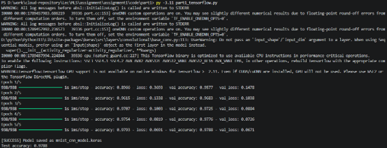
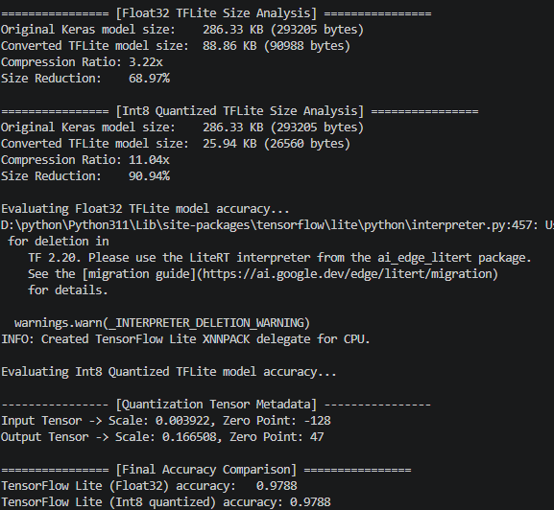
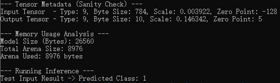

# MNIST TensorFlow and TensorFlow Lite Micro Assignment

This assignment implements the same MNIST image-classification model through
three deployment stages:

1. **Part 1:** create and train a small TensorFlow CNN and save it as a Keras
	 model.
2. **Part 2:** convert the Keras model to TensorFlow Lite and create a fully
	 integer (INT8) quantized model using representative training data.
3. **Part 3:** embed the quantized TensorFlow Lite model in a C++ program and
	 run inference in a simulated embedded environment using TensorFlow Lite
	 Micro.

## Project Layout

```text
code/
├── part1/
│   ├── part1_tensorflow.py
│   └── mnist_cnn_model.keras                 # generated by Part 1
├── part2/
│   ├── part2_tflite_conversion.py
│   ├── mnist_model.tflite                    # generated by Part 2
│   └── mnist_model_quantized.tflite          # generated by Part 2
└── part3/
		├── part3_micro_deployment.cc
		├── Makefile
		├── model_data.cc                          # generated from the INT8 model
		└── micro_inference_app                    # generated by make
```

## Requirements

### Python environment

Python 3.9 or newer and the following packages are required:

```bash
python -m pip install tensorflow numpy
```

The Python scripts download the MNIST dataset through Keras the first time
they are run, so network access is required for the initial execution.

### Linux or WSL environment for Part 3

Part 3 uses TensorFlow Lite Micro's Linux build system. It is not intended to
be compiled directly in a native Windows terminal. Use a Linux virtual machine
or WSL and clone the official TensorFlow Lite Micro repository into the Linux
home directory:

```bash
cd ~
git clone https://github.com/tensorflow/tflite-micro.git
```

The expected repository location is exactly:

```text
~/tflite-micro
```

This matches the default `TFLM_PATH := $(HOME)/tflite-micro` setting in the
Makefile. Build the TensorFlow Lite Micro library once before compiling this
assignment:

```bash
cd ~/tflite-micro
make -f tensorflow/lite/micro/tools/make/Makefile generate
```

Before compiling Part 3, check that [Makefile](code/part3/Makefile) contains
`-std=c++17` in `CXXFLAGS`. This flag is required by the current TensorFlow
Lite Micro sources.

## Instructions for Running All Code

Run each part from its own directory. The relative paths in the scripts and
Makefile depend on this working-directory layout.

### Part 1: Train the TensorFlow model

> **Python version note:** Some newer Python versions may not be compatible
> with the TensorFlow version installed on your system. If TensorFlow cannot
> be installed or imported, use a slightly older Python version and create a
> clean virtual environment. This assignment was tested with Python 3.11.

From the project root:

```bash
cd code/part1
python part1_tensorflow.py
```

The script downloads and normalizes MNIST, trains a CNN for five epochs, tests
the model, and writes:

```text
code/part1/mnist_cnn_model.keras
```

The final test accuracy is printed by the script and can vary slightly between
runs.

#### Part 1 Successful Run Screenshot

This screenshot should show the terminal output after `python part1_tensorflow.py`
finishes successfully. It should include the model-saved message and final test
accuracy.



### Part 2: Convert and quantize the model

After Part 1 completes, run:

```bash
cd ../part2
python part2_tflite_conversion.py
```

The script loads `../part1/mnist_cnn_model.keras` and creates:

- `mnist_model.tflite`: the Float32 TensorFlow Lite model.
- `mnist_model_quantized.tflite`: the fully INT8 TensorFlow Lite model.

For quantization, 100 training samples are used as the representative dataset.
The script also compares model sizes and evaluates both TensorFlow Lite models
on the MNIST test set. The INT8 model uses `int8` input and output tensors.

#### Part 2 Successful Run Screenshot

This screenshot should show the terminal output after
`python part2_tflite_conversion.py` finishes successfully. It should include
the successful creation of both `.tflite` files, model size analysis, and the
accuracy comparison between the Float32 and INT8 models.



### Part 3: Generate C++ model data

The C++ program includes the quantized model as a byte array. From the Part 3
directory, copy the model created in Part 2 and generate or refresh
`model_data.cc`:

```bash
cd ../part3
cp ../part2/mnist_model_quantized.tflite .
xxd -i mnist_model_quantized.tflite > model_data.cc
```

The generated symbols must be named:

```text
mnist_model_quantized_tflite
mnist_model_quantized_tflite_len
```

The command above produces these names automatically from the input filename.

### Part 3: Compile and run the simulated deployment

In the same terminal, still inside `code/part3`, remove stale object files and
the old executable before building:

```bash
make clean
make
./micro_inference_app
```

`make` compiles `part3_micro_deployment.cc` and `model_data.cc`, then links
them against the TensorFlow Lite Micro library under `~/tflite-micro`.

The program creates a 28x28 INT8 test image containing a vertical white line,
allocates the tensor arena, and runs inference. The terminal output includes:

- the embedded model size;
- the total tensor arena size and the number of bytes used;
- input and output tensor metadata, including type, scale, and zero point; and
- the predicted MNIST class for the simulated input.

#### Part 3 Successful Build and Inference Screenshot

This screenshot should show the terminal output after `make clean`, `make`, and
`./micro_inference_app` complete successfully. It should include the model
size, tensor arena usage, tensor metadata, and final predicted class.



## Complete Run Order

The complete workflow is:

```bash
# Part 1
cd code/part1
python part1_tensorflow.py

# Part 2
cd ../part2
python part2_tflite_conversion.py

# Part 3 (Linux or WSL)
cd ../part3
cp ../part2/mnist_model_quantized.tflite .
xxd -i mnist_model_quantized.tflite > model_data.cc
make clean
make
./micro_inference_app
```

## Troubleshooting

- **Model file not found:** verify that Part 1 was run from `code/part1` and
	Part 2 from `code/part2`.
- **TensorFlow Lite Micro headers or library not found:** verify that the
	repository exists at `~/tflite-micro` and that its Makefile generation step
	completed successfully.
- **C++ macro or language-standard errors:** verify that `-std=c++17` is
	present in `code/part3/Makefile`, then run `make clean` before `make` again.
- **`xxd` is unavailable:** install it in the Linux/WSL environment, for
	example with `sudo apt update && sudo apt install xxd`.